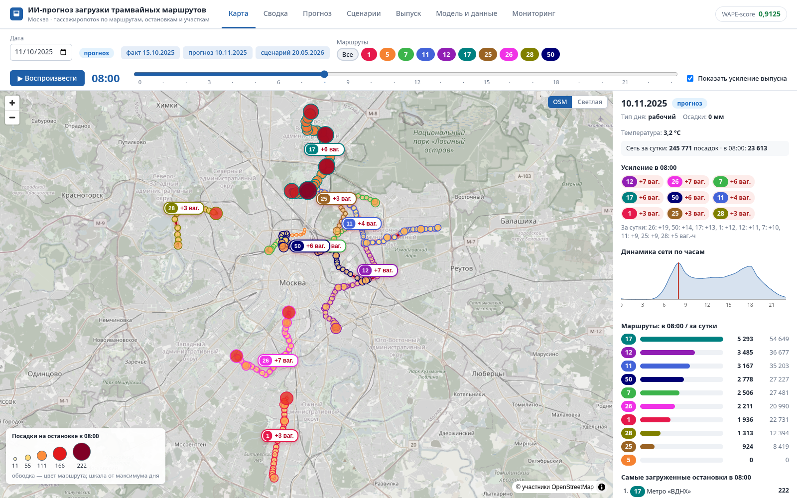
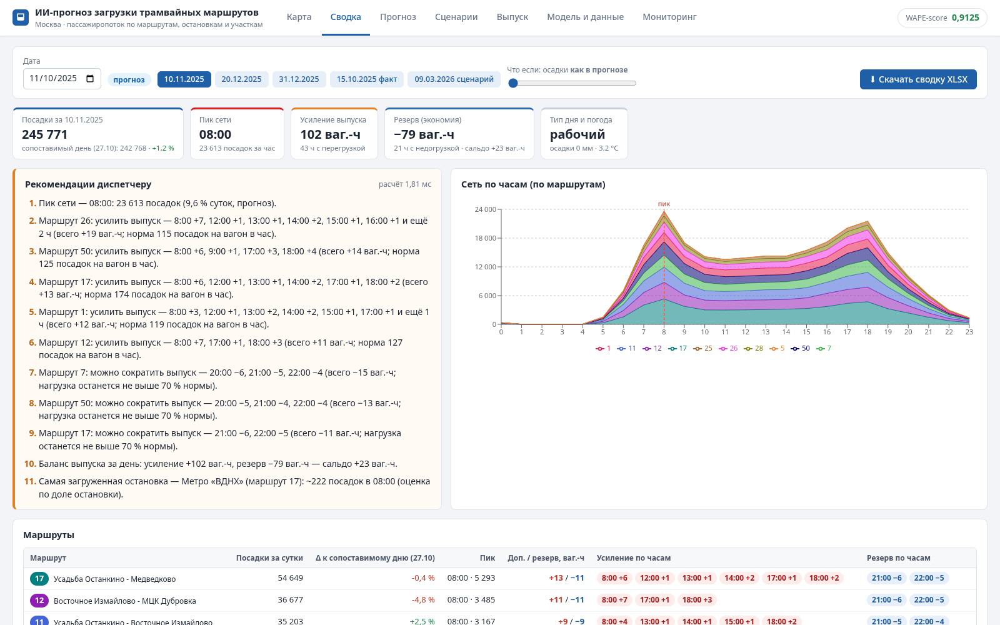
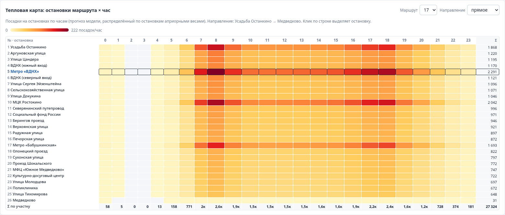
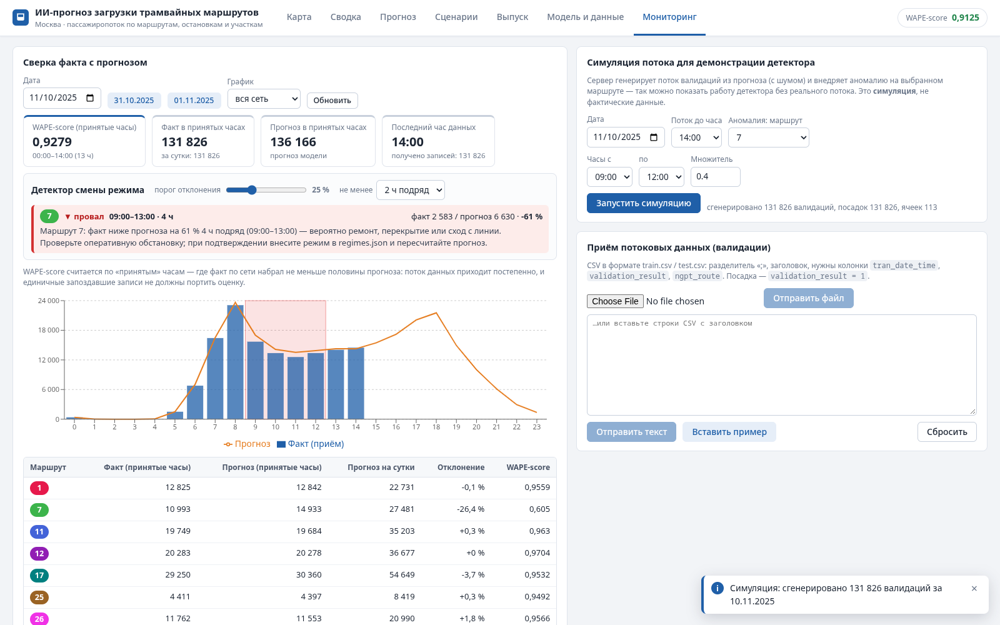
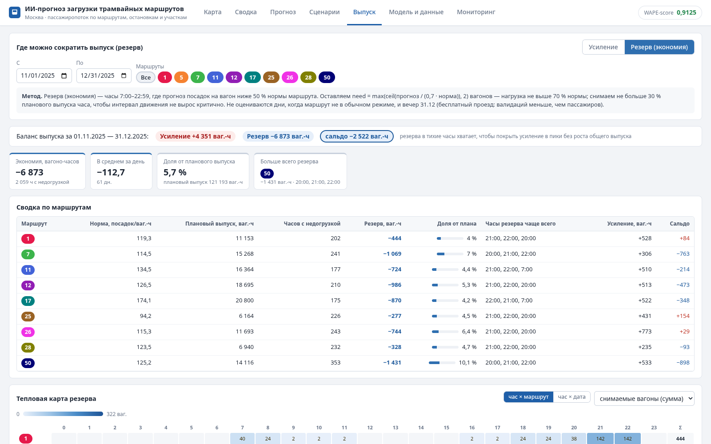
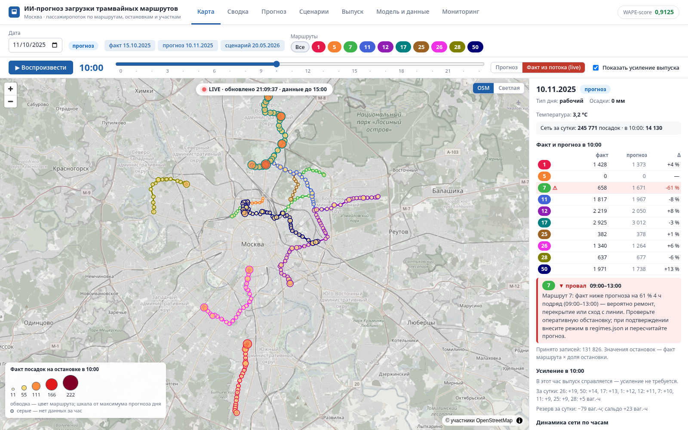

# ИИ-прогноз загрузки трамвайных маршрутов

**Демо:** https://hackathon.redlim.ru/ · Swagger: https://hackathon.redlim.ru/swagger-ui.html

Веб-сервис прогноза пассажиропотока (посадок) на 10 трамвайных маршрутах Москвы с привязкой к остановкам и
времени. В составе: ML-модель, backend (REST API) и frontend (дашборд с картой). Всё разворачивается через
Docker Compose.

| | |
|---|---|
| **Качество прогноза** | WAPE-score **0.9125** на лидерборде (порог максимального балла — 0.88, baseline — 0.48) |
| **Горизонты** | день (почасовой, 1.11–31.12.2025) · месяц (с интервалом) · год (сценарий 2026) · история-факт |
| **Агрегация** | маршрут · остановки · участок (отрезок остановок) · интервал дат и часов · час / день / месяц / итог |
| **Карта** | 10 маршрутов, 604 остановки, анимация по часам суток |
| **Выгрузка** | CSV и XLSX потоком: по маршрутам или по остановкам, до 1 млн строк |
| **Коэффициенты** | погода, сезон, маршрут, день недели, события — прогноз пересчитывается сразу |
| **Для диспетчера** | сводка дня с рекомендациями и XLSX · тепловая карта «остановка × час» · усиление и резерв выпуска (экономия ~6 900 вагоно-часов за 2 месяца) · живой факт на карте · детектор смены режима ([подробнее](#инструменты-диспетчера)) |
| **Производительность** | контейнер 2 vCPU / 2 ГБ, замеры на двух машинах. Ryzen 7 5800X3D: 2 100–7 000 RPS при p95 17–54 мс под предельной нагрузкой. Сервер на Xeon E3-1270 v6: 1 550–3 750 RPS при p95 32–72 мс. При 500 RPS — CPU ≤ 31 %, p95 ≤ 32 мс ([замеры](#производительность)). 3 реплики за nginx — ×2.8–2.9 RPS ([масштабирование](#горизонтальное-масштабирование)) |



## Запуск для жюри

Нужен только Docker (Compose v2).

```bash
docker compose up -d --build
```

Первая сборка занимает ~3–5 минут: скачиваются зависимости Python, Maven и npm.

| Что | Адрес |
|---|---|
| Дашборд | http://localhost:8081 |
| REST API | http://localhost:8080/api/v1 (через фронт — http://localhost:8081/api/v1) |
| Swagger UI | http://localhost:8080/swagger-ui.html (через фронт — http://localhost:8081/swagger-ui.html) |
| Health / метрики | http://localhost:8080/actuator/health, `/actuator/prometheus` |

Порты меняются переменными: `BACKEND_PORT=18080 FRONTEND_PORT=18081 docker compose up -d --build`.
Остановка: `docker compose down`.

- В OpenAPI адрес сервера относительный (`/`), поэтому «Try it out» в Swagger работает на любом порту и за
  HTTPS-прокси (демо), без mixed content.
- CORS по умолчанию выключен: интерфейс ходит к API с того же адреса через nginx. Разрешить другие Origin —
  переменной окружения backend `APP_CORS_ORIGINS=https://a.example,https://b.example`.

Проверка API:

```bash
# почасовой прогноз маршрута 7 на 10.11.2025, утренний пик 07:00–10:00 (часы включительно: 7, 8, 9)
curl "localhost:8080/api/v1/forecast?routes=7&from=2025-11-10&to=2025-11-10&hourFrom=7&hourTo=9"
# месяц: суммы по маршрутам за декабрь с интервалом
curl "localhost:8080/api/v1/forecast?horizon=month&granularity=month&from=2025-12-01&to=2025-12-31"
# год 2026 по месяцам, вся сеть одним рядом
curl "localhost:8080/api/v1/forecast?horizon=year&granularity=month&split=none"
# участок маршрута 1 (направление 0, остановки 3–10) по дням
curl "localhost:8080/api/v1/forecast?segment=1:0:3-10&granularity=day&from=2025-11-10&to=2025-11-16"
# сценарий: ливень 15 мм 5.12, декабрь ×1.03, перекрытие 7 и 50 на выходных 20–21.12 с 10:00 до 18:00 (| → %7C)
curl "localhost:8080/api/v1/forecast?granularity=day&from=2025-12-01&to=2025-12-31&precip=2025-12-05:15&monthMult=12:1.03&event=7%7C50:2025-12-20:2025-12-21:0.5:10-17"
# выгрузка XLSX по остановкам
curl -o forecast.xlsx "localhost:8080/api/v1/export?format=xlsx&level=stop&granularity=day"
# приём сырых валидаций (формат train.csv) и сверка с прогнозом/фактом;
# без заголовка X-Workspace данные идут в общую рабочую область «default»
curl -X POST -H "Content-Type: text/csv" --data-binary @data/samples/validations_2025-10-31_evening.csv localhost:8080/api/v1/ingest/validations
curl "localhost:8080/api/v1/monitoring?date=2025-10-31"   # сверка приёма с эталонным фактом labels
# сводка диспетчера на день и её XLSX
curl "localhost:8080/api/v1/summary?date=2025-11-10"
curl -o summary.xlsx "localhost:8080/api/v1/summary/export?date=2025-11-10"
# детектор смены режима: симуляция потока с «ремонтом» на маршруте 7 (×0.4 с 9 до 13 ч) → алерт в мониторинге
# (симуляция заменяет принятые данные этой даты, повторный запуск не суммируется)
curl -X POST "localhost:8080/api/v1/ingest/simulate?date=2025-11-10&toHour=14&anomalyRoute=7&anomalyFromHour=9&anomalyToHour=12&anomalyMult=0.4"
curl "localhost:8080/api/v1/monitoring?date=2025-11-10"    # → alerts: маршрут 7, 09:00–13:00, −61 %
curl -X DELETE localhost:8080/api/v1/ingest
```

Полное описание API — [docs/api.md](docs/api.md) и Swagger UI.

## Что внутри

```
Tramvay/                ML-часть: модель, обучение/инференс, внешние данные, README модели
  ml/                   код модели (ingest, календарь, погода, режимы, структурная модель, горизонты, бэктест)
  ml/outputs/           артефакты модели: прогнозы день/месяц/год, ошибки, выпуск (вход сервиса)
  ml/external/          внешние данные: календарь, погода, пробки
  predict.py            воспроизведение сабмита 0.9125
pipeline/               пайплайн данных сервиса: артефакты модели + геопривязка → service_data/
  schedule_binding.py   геопривязка посадок к остановкам по расписанию выхода (+ tests/)
  demo_synthetic_schedule.py  синтетическое полное расписание для демонстрации геопривязки
backend/                Java 21, Spring Boot 4.1 WebFlux (Netty): REST API
frontend/               React 19 + TypeScript + Vite, MapLibre GL, Recharts; nginx
data/reference/         справочник ГТФС (из датасета), остановки OSM, пример валидаций
data/samples/           сырые валидации для демонстрации приёма, отчёт геопривязки по расписанию
loadtest/               нагрузочный тест (hey) и результаты
docs/                   API, архитектура, скриншоты
docker-compose.yml
```

Архитектура и схема модулей — [docs/architecture.md](docs/architecture.md). Кратко:

```
сырые валидации ─► приём/нормализация ─► признаки (календарь, погода, режимы) ─► структурная модель ─► ml/outputs
справочник ГТФС + OSM ─► геопривязка остановок ─┐                                                    │
                                                 └──────────────► pipeline ─► service_data ◄─────────┘
                                                                                   │
            браузер ◄── frontend (React, MapLibre) ◄── REST API (WebFlux) ◄── агрегация + коэффициенты
```

## Функциональность

**Горизонты прогноза**
- **День (краткосрочный):** почасовые посадки на 1.11–31.12.2025 по каждому маршруту — прогноз модели,
  сабмит 0.9125.
- **Месяц (среднесрочный):** суммы по дням и месяцам. Для полного месяца есть интервал: ±14.1 % для маршрута,
  ±11.3 % для сети — 80-й перцентиль ошибки месяца на бэктесте. Для часов, дней и остановок интервал не
  измерен и не показывается.
- **Год (долгосрочный):** сценарий 2026 года по дням и месяцам, у месяцев — интервал. Почасовая форма
  берётся из профиля суток ноября–декабря по типу дня.
- **История:** факт января–октября 2025 для сравнения.

**Агрегация** — `/api/v1/forecast`:
- объект: маршруты (`routes`), остановки (`stops`) или участок (`segment=маршрут:направление:с-по`).
  Остановка — `ID` (все её вхождения; конечная, общая для обоих направлений, суммирует оба) или
  `ID@направление` (`stops=2594@0` — только это направление; так её выбирает интерфейс);
- интервал: даты `from`/`to` и часы `hourFrom`/`hourTo`;
- гранулярность: `hour` / `day` / `month` / `total`;
- ряды: по маршрутам или сумма (`split`).

**Дашборд** (http://localhost:8081):
- **Карта** Москвы. Трассы 10 маршрутов; остановки меняют размер и цвет по прогнозу посадок в выбранный час.
  Слайдер часа и кнопка «▶ Воспроизвести» анимируют сутки. Работает для факта (январь–октябрь), прогноза
  (ноябрь–декабрь) и сценария 2026. По клику на остановку — профиль её суток. Флажок «Показать усиление выпуска»
  выделяет маршруты, которым в текущий час нужны дополнительные вагоны, с числом вагонов. Режим «Факт из
  потока (live)» показывает принятые валидации в реальном времени, с автообновлением и алертами детектора.
  Без WebGL2 вместо карты — сообщение «Карта недоступна: браузер не поддерживает WebGL2 …», остальные вкладки
  работают.
- **Сводка**: сводка диспетчера на день с рекомендациями и тепловой картой «остановка × час»
  ([подробнее](#инструменты-диспетчера)). Режим (факт / прогноз / сценарий) определяется по выбранной дате;
  для дат истории (≤ 31.10.2025) ползунок «Что если: осадки» выключен и сброшен.
- **Прогноз**: выбор горизонта, маршрутов, остановок или участка, интервала и гранулярности. График с
  интервалом, таблица, выгрузка CSV/XLSX. Остановки выбираются в конкретном направлении; при смене
  направления выбор сбрасывается.
- **Сценарии**: корректирующие коэффициенты — осадки по дням, множители месяцев, маршрутов и дней недели,
  события (перекрытие, ремонт, концерт). Прогноз с поправками и без показывается рядом, с влиянием по маршрутам.
- **Выпуск**: усиление — часы, в которые прогноз посадок на вагон выше нормы маршрута, и сколько вагонов добавить
  (всего, в пределах парка маршрута и в пределах парка сети); резерв — где выпуск можно сократить без
  переполнения; баланс вагоно-часов. Показатели, баланс и таблица — за выбранный период, «В среднем за день» —
  по дням периода.
- **Модель и данные**: качество на бэктесте, внешние источники со ссылками, режимы и события, область применимости.
- **Мониторинг**: загрузка сырых валидаций и сравнение факта с прогнозом (WAPE-score по прошедшим часам).
  Детектор смены режима выдаёт алерты, для демо есть симуляция потока с аномалией. Каждая вкладка браузера
  работает в своей рабочей области (`X-Workspace`), поэтому пользователи публичного демо не видят и не стирают
  данные друг друга. Если нет ни одного «принятого» часа, вместо «режим работы штатный» — «недостаточно данных
  для оценки». Загрузка CSV дописывается к принятому: повторная загрузка того же файла удвоит факт, перед
  повтором нужно нажать «Сбросить».

Если страница падает с ошибкой, шапка и вкладки остаются на месте (ErrorBoundary на каждую страницу), вместо
белого экрана.

### Инструменты диспетчера

Шесть функций превращают прогноз в действия: что будет, где тесно, куда добавить вагоны, где их снять без
переполнения, что происходит сейчас и что пошло не так.

| Сводка диспетчера | Тепловая карта «остановка × час» |
|---|---|
|  |  |
| **Усиление выпуска на карте** | **Детектор смены режима** |
|  |  |
| **Резерв выпуска (экономия)** | **Живой факт на карте** |
|  |  |

1. **Сводка диспетчера** (вкладка «Сводка», `GET /api/v1/summary`, XLSX — `/api/v1/summary/export`). Одна
   страница на выбранный день:
   - посадки за сутки, пиковый час сети, тип дня и погода;
   - сравнение с **сопоставимым днём** — тем же днём недели и типом дня; праздники пропускаются, поэтому
     понедельник после праздника не сравнивается с праздником;
   - маршруты с пиками и изменением;
   - часы и объём усиления выпуска;
   - 10 самых загруженных остановок;
   - действующие события и режимы со ссылками на источники.

   Главное на странице — **список рекомендаций**, например: «Маршрут 26: усилить выпуск — 8:00 +7, 12:00 +1, …»,
   «Осадки 12,8 мм (архив Open-Meteo): ожидаемый эффект на спрос −2,2 %», «Действует: Т1 (маршруты [7])».
   Работает для факта, прогноза и сценария 2026 и учитывает корректирующие коэффициенты. XLSX удобно разослать в депо.
2. **Тепловая карта «остановка × час»** (на вкладке «Сводка»). Остановки маршрута по порядку следования —
   строки, часы суток — столбцы, цвет — прогноз посадок. Видно, на каком участке и в какой час пик: где
   ставить дополнительные рейсы или укороченные выпуски.
3. **Усиление выпуска на карте** (слой на вкладке «Карта»). При анимации по часам маршруты, которым не хватает
   вагонов, выделяются на карте с подписью «+N ваг.». В боковой панели — список «где и сколько добавить в этот
   час». Расчёт — `ml/fleet.py`, см. «[Бизнес-ценность](#бизнес-ценность)».
4. **Детектор смены режима** (вкладка «Мониторинг», поле `alerts` в `/api/v1/monitoring`). Главная слабость
   модели — незнание режимов маршрутов: ремонтов, закрытий, запусков. Одна дата окончания ремонта 7/50 стоила
   0.0063 score. Детектор сравнивает поступающий поток валидаций с прогнозом. Алерт появляется, если факт
   маршрута отклоняется больше порога (по умолчанию 25 %) несколько часов подряд (по умолчанию 2):
   - **падение** — «вероятно ремонт, перекрытие или сход с линии»;
   - **рост** — «вероятно перераспределение пассажиров или массовое событие»;
   - **обвал сети** (`network_drop`, маршрут 0 — «вся сеть») — часы с данными, где факт по сети ниже 50 %
     прогноза, а данные пришли хотя бы по половине маршрутов: вероятно сбой валидаторов или передачи данных.
     Такие часы не «принимаются», поэтому не входят в WAPE-score и в маршрутный детектор — без этого сигнала
     обвал всей сети остался бы незамеченным.

   Порог и число часов настраиваются. Реальных данных за ноябрь–декабрь нет, поэтому для демонстрации есть
   **симуляция потока** (`POST /api/v1/ingest/simulate`): прогноз ± 5 % шума с внедрённой аномалией. Симуляция
   заменяет принятые данные этой даты, а не прибавляется к ним. Детектор находит ровно внедрённую аномалию —
   маршрут 7, 09:00–13:00, −61 % — без ложных срабатываний, в том числе после повторных запусков (тесты
   `detectorFindsInjectedAnomalyOnly`, `repeatedSimulationReplacesDateInsteadOfSumming`).
5. **Резерв выпуска — экономия** (вкладка «Выпуск», поле `reserve` в `/api/v1/fleet`, колонка и рекомендации
   в «Сводке»). Обратная задача к усилению: часы, где прогноз посадок на вагон ниже половины нормы маршрута.
   Правила консервативные:
   - оставляем столько вагонов, чтобы нагрузка была не выше 70 % нормы, но не меньше двух;
   - снимаем не больше 30 % планового выпуска часа, чтобы интервал движения не вырос критично;
   - только 7:00–22:59: в 0–6 и 23 ч вагоны выходят на линию и сходят в депо, час неполный;
   - только обычный режим маршрута; вечер 31.12 (бесплатный проезд) исключён.

   **Итог на ноябрь–декабрь: 6 873 вагоно-часа (~113 в день, 5,7 % планового выпуска с 7 до 23 ч)** можно
   высвободить. В основном это вечер 20–23 ч и утро выходных. С часами усиления резерв не пересекается. По
   балансу вагоно-часов резерв (6 873) больше всей потребности в усилении (4 351). Но это баланс за период, а не
   план на пик: в пиковый час вагоны ограничены парком сети, и в его пределах выполнимо 2 377 вагоно-часов
   усиления (см. «[Бизнес-ценность](#бизнес-ценность)»). Расчёт — `Tramvay/ml/fleet.py → reserve()`,
   `python -m ml fleet`.
6. **Живой факт на карте** — «в реальном времени» (режим «Факт из потока» на вкладке «Карта»,
   `GET /api/v1/map/live`). Принятые валидации (`/ingest`) раскладываются по остановкам и показываются на карте
   с автообновлением каждые 5 с. Часы без данных серые, маршруты с алертами детектора помечены. Для демо —
   та же симуляция потока.

**Надёжность API.** Ошибки приложения отдаются как `application/problem+json` с сообщением на русском. В ответе
указан параметр с ошибкой и допустимые значения, например:
`«Параметр from: дата 2025-10-01 вне горизонта day (2025-11-01 … 2025-12-31)»`.
Коды: 400 — неверные параметры, 404 — нет ресурса, 413 — слишком большая выгрузка, 415 — неверный формат,
503 — уже идут 2 XLSX-выгрузки (повторить позже или выгрузить CSV).
Интерфейс показывает эти сообщения пользователю, в том числе при неудачной выгрузке. Синтаксически битый URL
(например, неэкранированный `|`) отклоняет сам HTTP-сервер с пустым телом 400 — спецсимволы нужно кодировать.

## ML-модель

Подробно — [Tramvay/README.md](Tramvay/README.md): формула, калибровки, бэктест, внешние источники.

```
ŷ(маршрут, день, час) = W(маршрут) · R(маршрут, тип дня, режим) · S(маршрут, тип дня, час)
                        · K_календарь(день) · K_маршрут · K_события(маршрут, день, час)
```

- **W** — уровень будня за последние 3 недели;
- **R** — отношение выходного или праздника к будню с учётом режима маршрута (ремонт, закрытие);
- **S** — профиль суток за 4 недели со сдвигом к зимней форме;
- **K** — производственный календарь, события (запуск Т1, бесплатный проезд 31.12), холодный старт маршрута 5.

**Калибровка по лидерборду.** Лидерборд использован как канал обратной связи — эквивалент свежих данных за
ноябрь–декабрь, которых нет в датасете. В сервисе ту же роль играет мониторинг факта против прогноза. Каждая
поправка — одно изменение, записанное в `Tramvay/ml/config.py` и `regimes.json` вместе с цифрами проб.
Без калибровки структурная модель даёт **0.893** — уже выше порога максимального балла (0.88). Поправки добавили
+0.019 и на другие периоды не переносятся (см. [Tramvay/README.md](Tramvay/README.md#что-откалибровано-по-лидерборду)).

Воспроизведение сабмита: `cd Tramvay && pip install -r requirements.txt && python predict.py`.
Нужен `dataset/` организаторов. Таблицы для сервиса собирает `python -m ml export` → `ml/outputs/`.

Бэктест — 5 временных фолдов, обучение строго до отсечки:

| Горизонт | Score по часам | Score по суткам |
|---|---|---|
| 1–7 дней | 0.860 | 0.886 |
| 8–14 дней | 0.897 | 0.927 |
| 15–30 дней | 0.890 | 0.925 |
| 31–61 день | 0.866 | 0.894 |
| месяц маршрута / сети | 0.921 / 0.934 | — |

## Внешние источники

| Источник | Эффект | Ссылка / способ получения |
|---|---|---|
| Производственный календарь РФ 2025–2026 | праздники, переносы, 1.11 — рабочая суббота | https://isdayoff.ru/api/getdata?year=2025&pre=1 (и `year=2026`); копии — `Tramvay/ml/external/calendar/` |
| Погода Open-Meteo (ERA5): осадки, температура | −0.64 % посадок на мм осадков (t = −6.2); в сервисе — корректирующий коэффициент | https://archive-api.open-meteo.com/v1/archive?latitude=55.7558&longitude=37.6173&start_date=2025-01-01&end_date=2025-12-31&hourly=temperature_2m,precipitation,rain,snowfall&timezone=Europe%2FMoscow; копии — `Tramvay/ml/external/weather/` |
| Пробки ЦОДД (баллы 0–10) | проверено: влияния на посадки нет (t = −0.35), в прогноз не включены | https://t.me/s/DtOperativno; выгрузка и проверка — `Tramvay/ml/external/traffic/` |
| Ремонт в Протопоповском пер. (7 и 50 по выходным) и его окончание | +0.0063 к score | https://www.mskagency.ru/materials/3506273, https://www.mskagency.ru/materials/3523754 |
| Запуск трамвайного диаметра Т1 (12.11.2025) | отток с маршрута 7 ≈ 6 % (+0.0015) | https://t.me/DtOperativno/23513, https://www.mos.ru/mayor/themes/13679050/ |
| Бесплатный проезд 31.12 с 20:00 | валидаций почти нет (+0.0006) | https://t.me/DtRoad/55780 |
| Запуск маршрута 5 (16.12.2025) | холодный старт от аналога | https://www.mos.ru/mayor/themes/13888050/ |
| Справочник ГТФС (из датасета) | остановки и порядок следования маршрутов 1, 5, 7, 11, 12 | `dataset.zip → spravochniki/` → `data/reference/tram_reference.xlsx` |
| OpenStreetMap, relation `route=tram` | остановки маршрутов 17, 25, 26, 28, 50 — их нет в справочнике | https://api.openstreetmap.org/api/0.6/relation/540033/full.json (id 540033, 540139, 1538169, 1538170, 1689026, 1689064, 3184022, 3184023, 3186264, 3186265); копия — `data/reference/osm_tram_routes.json` |

Все режимы и события со ссылками на новости лежат в `Tramvay/ml/regimes.json`. В интерфейсе они на вкладке
«Модель и данные».

## Область определения и адаптации модели

**Где модель валидна:**
- **Маршруты:** 9 маршрутов с историей не короче 6 недель в текущем режиме. Маршрут 5 — холодный старт:
  профиль аналога (маршрут 7), уровень откалиброван, точность ниже.
- **Горизонт:** почасовой прогноз проверен до 61 дня. Суточный и месячный точнее почасового. Год —
  качественный сценарий: полного годового цикла в данных нет, на данных он не проверен.
- **Остановки:** прогноз по остановкам — это прогноз маршрута, разложенный по априорным долям
  (см. [architecture.md](docs/architecture.md#геопривязка-остановок)). В валидациях нет остановки, поэтому
  сумма по маршруту точна, а распределение между остановками — оценка.
- **Геопривязка по расписанию:** модуль `pipeline/schedule_binding.py` привязывает посадку к остановке по
  маршруту, выходу (`bus_exit_no` = график) и времени: рейс графика, внутри которого время посадки, →
  остановка, у которой вагон стоит или которую только что прошёл. Каждой посадке присваивается статус
  (`bound`, `ambiguous`, `no_schedule_for_route`, `no_schedule_for_grafic`, `outside_trips`, `bad_record`), отчёт
  о покрытии — JSON.
  - **Рейс** — составной ключ (маршрут, график, `service_id`, `trip_id`, `trip_num`, `shift_num`) из имеющихся
    колонок. В формате организаторов `trip_id` — шаблон рейса (вариант направления): он повторяется для всех
    рейсов графика, сам рейс различает `trip_num`. Раньше рейсы с одним `trip_id` склеивались в один, и посадки
    уходили на конечные при «100 % привязано». Расписания с уникальным `trip_id` без `trip_num` (например,
    синтетическое) работают так же. Если `trip_num` нет, а номера остановок в группе повторяются, группа делится
    на рейсы по сбросу `stop_sequence`.
  - **Проверка времени рейса:** времена по порядку остановок не убывают; допускается один переход через полночь
    (падение больше 12 ч, например 23:55 → 00:05; формат «24:10» тоже понимается). Немонотонные рейсы
    исключаются из привязки и считаются в отчёте: `schedule_checks.trips_non_monotonic` (с примерами и числом
    разделённых шаблонов).
  - **Тип дня (`service_id`):** для посадки берутся только рейсы, действующие в её дату (после полуночи на
    рейсе, начатом накануне, — предыдущая дата). Правило: календарь `--calendar calendar.csv` (как GTFS
    `calendar.txt`: `service_id`, `monday`…`sunday` = 0/1, необязательные `start_date`/`end_date` YYYYMMDD) →
    иначе эвристика по названию (будни/weekday/рабочие → пн–пт; выходные/weekend/нерабочие → сб–вс;
    суббота/sat/сб → сб; воскресенье/sun/вс → вс; ежедневно/daily → все дни) → иначе (например, числовой
    `3172953`) — действует во все дни. Праздники не учитываются. Правило каждого `service_id` — в отчёте,
    `service_mapping`.
  - **`ambiguous`:** время посадки внутри нескольких рейсов графика с разными направлением или остановкой (после
    фильтра по типу дня). Такие посадки не входят в доли остановок; статус есть в `by_status` и `by_route`
    отчёта. Рейс, закончившийся ровно в момент посадки, уступает начинающемуся: смена рейса на конечной — не
    `ambiguous`.
  - В CSV привязанных посадок (`--bound-out`) есть колонки `trip_num` и `service_id`.

  Модуль реализован и покрыт тестами (46 pytest). В справочнике расписание — образец из 15 строк: маршрут 1,
  график 206, один рейс 06:53–07:11. В демо-выгрузке (400 000 строк, 30.10–1.11.2025) 371 920 посадок, привязано **0**:
  график 206 в эти дни не выходил, у маршрута 1 выходы 201–214 и 803–806 (без 203, 204, 206, 805).

  **Демонстрация на синтетическом полном расписании.** Чтобы проверить цепочку «расписание → привязка → доли
  остановок → сервис» целиком, `pipeline/demo_synthetic_schedule.py` строит расписание-заглушку для маршрута 1:
  реальный порядок остановок из справочника (по 22 в каждом направлении), реальные 14 выходов из валидаций
  (201…214, 803…806 с пропусками), рейсы туда-обратно с 5:30 до 1:00, 2 минуты между остановками. Время прохождения остановок синтетическое, поэтому
  сами доли не отражают реальность; проверяется механизм:

  | Валидации | Посадок | Привязано к остановкам | Маршрут 1 | Результат |
  |---|---:|---:|---:|---|
  | `data/samples/validations_2025-10-31_evening.csv` (в репозитории) | 21 799 | 1 388 | 95 % его посадок | доли 1 записаны |
  | хвост `test.csv`, 30.10–1.11.2025 (400 000 строк) | 371 920 | 20 246 | 95 % его посадок | доли 1 записаны |

  Остальные маршруты получают статус `no_schedule_for_route` и остаются на априорных долях. Данные сервиса
  пересобираются с полученным `stop_weights.csv`, и backend подхватывает фактические доли без изменения кода.
  Проверено на запущенном сервисе (доли — по хвосту `test.csv`, вторая строка таблицы выше):

  | Остановка маршрута 1 | Априорная доля | Доля по расписанию |
  |---|---:|---:|
  | Чертаново Южное | 4,23 % | 4,00 % |
  | Поликлиника | 2,68 % | 2,22 % |
  | Чертановская улица, 44 | 2,42 % | 1,76 % |
  | Кировоградские пруды | 2,48 % | 2,55 % |

  - Прогноз по остановке меняется: «Поликлиника» за ноябрь–декабрь — было 30 535 посадок, стало 25 285.
  - Прогноз маршрута целиком (1 137 578) не меняется: сумма долей по-прежнему равна 1.
  - Маршруты без расписания сохраняют прежние доли.

  С реальным полным расписанием ГТФС это работает так же для маршрутов 1, 5, 7, 11, 12. Для 17, 25, 26, 28, 50
  нужен ещё полный справочник остановок: сейчас их остановки из OSM, идентификаторы с расписанием не совпадут.

  ```bash
  python pipeline/demo_synthetic_schedule.py --validations data/samples/validations_2025-10-31_evening.csv --out /tmp/schedule.csv
  python pipeline/schedule_binding.py --validations data/samples/validations_2025-10-31_evening.csv \
      --schedule /tmp/schedule.csv --report /tmp/report.json --write-weights /tmp/ref/stop_weights.csv
  cp data/reference/tram_reference.xlsx data/reference/osm_tram_routes.json /tmp/ref/
  python pipeline/build_service_data.py --ref /tmp/ref --out /tmp/service_data   # сервис: APP_DATA_DIR=/tmp/service_data
  ```
  Отчёт прогона со справочным образцом расписания на хвосте `test.csv` (привязано 0):
  [data/samples/binding_report_demo.json](data/samples/binding_report_demo.json).
  С полным расписанием модуль посчитает фактические доли остановок. Для маршрутов с достаточным покрытием
  (по умолчанию ≥ 1000 посадок и ≥ 80 % остановок) доли пишутся в `data/reference/stop_weights.csv` и заменяют
  априорные при следующей сборке — без изменения кода.

**От чего зависит:** производственный календарь периода (обязательно); режимы и события — ремонты, закрытия,
запуски (обязательно, иначе ошибка максимальна); погода (корректирующий коэффициент); пробки не нужны
(проверено).

**Как перенести:**
- **Новый период:** календарь года, свежие валидации (`python -m ml ingest`), актуальный `regimes.json`,
  переобучение за секунды, затем `docker compose build`.
- **Новый маршрут:** аналог по району и типу линии — его профили и отношения типов дня. Уровень — по первым
  2–3 неделям или по плану выпуска. Остановки — из ГТФС или OSM.

**Пределы применимости.** Модель не покрывает:
- незапланированные аварии;
- смену тарифов;
- перетоки между видами транспорта;
- наполненность вагонов: в данных есть посадки, а высадок нет.

## Производительность

**Методика.** Контейнер backend запускается с жёстким ограничением: 2 логических ядра
(`--cpus=2 --cpuset-cpus=0,1`) и 2 ГБ RAM без swap (`--memory=2g --memory-swap=2g`). Генератор нагрузки
[hey](https://github.com/rakyll/hey) работает на других физических ядрах: SMT-соседи ядер сервиса исключаются,
чтобы не отнимать у него CPU. Перед замером — прогрев JIT, 5 с на сценарий. Замер — 20 с на сценарий в двух режимах:
- **max** — 64 параллельных соединения без ограничения скорости;
- **500 rps** — фиксированная нагрузка 50 × 10 запросов/с.

CPU считается из cgroup (`cpu.stat`) в процентах от 2 ядер, RAM — `memory.current` контейнера. Регулятор частоты
CPU на обеих машинах — `performance`. Воспроизвести: `loadtest/run.sh`.

Сценарии:
1. почасовой прогноз маршрута на день — типовой запрос диспетчера;
2. сценарий с коэффициентами (осадки, месяц, маршрут, событие) по дням за месяц, все маршруты;
3. участок маршрута (8 остановок) по часам за неделю;
4. год 2026 по месяцам, все маршруты: 87 600 ячеек на запрос;
5. карта дня — 604 остановки × 24 часа, 200 КБ JSON (47 КБ gzip). Ответ детерминирован, поэтому кэшируется уже
   сериализованным и сжатым — повторные запросы не тратят CPU на сериализацию и gzip;
6. сводка диспетчера на день: все маршруты, усиление, горячие остановки, рекомендации.

Замеры сделаны 27.09.2026 на двух машинах одним и тем же образом (`main`, коммит `6cb8e7e`).

**Что такое «2 ядра» в этих замерах.** Ядра 0 и 1 — два разных физических ядра, их SMT-соседи простаивают.
Облачные «2 vCPU» обычно означают одно физическое ядро с двумя потоками. Контрольный замер на рабочей станции
(почасовой прогноз маршрута на день, 64 соединения, 15 с):

| Контейнер | RPS | p95 | CPU |
|---|---:|---:|---:|
| 2 физических ядра (`--cpuset-cpus=0,1`), как в таблицах ниже | 8 265 | 14.6 мс | 94 % |
| 1 физическое ядро + SMT-сосед (`--cpuset-cpus=0,8`), как облачные 2 vCPU | 4 554 | 26.6 мс | 95 % |

На «облачных» 2 vCPU пропускная способность примерно в 1.8 раза ниже приведённой ниже. Требование ТЗ
выполняется и тогда с большим запасом: тысячи RPS типовых запросов при p95 ~30 мс.

### Машина 1: рабочая станция

AMD Ryzen 7 5800X3D (8 ядер / 16 потоков), 64 ГБ DDR4 3000 МГц, CachyOS (Linux 7.2), Docker 29.8. Сервис — на
ядрах 0,1, генератор нагрузки — на 2–7 и 10–15 (8 и 9 — SMT-соседи ядер сервиса). Сырые отчёты — `loadtest/results/`.

| Сценарий | Режим | RPS | p50, мс | p95, мс | p99, мс | CPU (из 2 ядер) | RAM | Ошибки |
|---|---|---:|---:|---:|---:|---:|---:|---|
| 1. День маршрута по часам | max, 64 соединения | **6 972** | 7.9 | 17.2 | 24.1 | 95 % | 335 МБ | 0 |
| | 500 rps | 500 | 3.6 | 6.6 | 9.2 | 6 % | 337 МБ | 0 |
| 2. Сценарий с коэффициентами, месяц по дням | max | **3 153** | 18.9 | 34.8 | 42.2 | 97 % | 336 МБ | 0 |
| | 500 rps | 500 | 8.8 | 17.7 | 26.2 | 15 % | 333 МБ | 0 |
| 3. Участок маршрута по часам за неделю | max | **5 410** | 10.9 | 20.0 | 26.4 | 95 % | 329 МБ | 0 |
| | 500 rps | 500 | 5.5 | 10.4 | 15.5 | 9 % | 336 МБ | 0 |
| 4. Год 2026 по месяцам, все маршруты | max | **2 110** | 28.4 | 53.8 | 61.1 | 98 % | 336 МБ | 0 |
| | 500 rps | 499 | 13.5 | 27.7 | 40.2 | 23 % | 336 МБ | 0 |
| 5. Карта дня: 604 остановки × 24 ч | max | **10 376** | 4.8 | 16.5 | 24.5 | 52 % | 337 МБ | 0 |
| | 500 rps | 500 | 4.6 | 8.0 | 9.6 | 2 % | 337 МБ | 0 |
| 6. Сводка диспетчера на день | max | **3 602** | 16.4 | 30.1 | 38.0 | 96 % | 337 МБ | 0 |
| | 500 rps | 499 | 8.2 | 17.3 | 24.0 | 13 % | 339 МБ | 0 |

### Машина 2: сервер развёртывания

Intel Xeon E3-1270 v6 (4 ядра / 8 потоков, 3.8–4.2 ГГц), 16 ГБ DDR4, плата ASUS Z170 PRO GAMING, Debian 13
(Linux 6.12), Docker 29.3. Сервер не выделенный: параллельно работают другие сервисы (игровой сервер, Jitsi,
PostgreSQL). Сервис — на ядрах 0,1, генератор нагрузки — на 2,3,6,7 (4 и 5 — SMT-соседи ядер сервиса). Сырые
отчёты — `loadtest/results-lanserver/`.

| Сценарий | Режим | RPS | p50, мс | p95, мс | p99, мс | CPU (из 2 ядер) | RAM | Ошибки |
|---|---|---:|---:|---:|---:|---:|---:|---|
| 1. День маршрута по часам | max, 64 соединения | **3 748** | 15.2 | 32.3 | 44.3 | 97 % | 292 МБ | 0 |
| | 500 rps | 500 | 5.3 | 9.6 | 11.9 | 9 % | 292 МБ | 0 |
| 2. Сценарий с коэффициентами, месяц по дням | max | **2 132** | 27.9 | 50.9 | 64.9 | 98 % | 293 МБ | 0 |
| | 500 rps | 499 | 12.3 | 22.7 | 26.6 | 22 % | 293 МБ | 0 |
| 3. Участок маршрута по часам за неделю | max | **3 354** | 17.7 | 33.0 | 42.8 | 98 % | 293 МБ | 0 |
| | 500 rps | 500 | 7.8 | 14.7 | 17.6 | 14 % | 293 МБ | 0 |
| 4. Год 2026 по месяцам, все маршруты | max | **1 552** | 39.0 | 71.5 | 87.6 | 99 % | 293 МБ | 0 |
| | 500 rps | 499 | 17.0 | 31.5 | 35.6 | 31 % | 293 МБ | 0 |
| 5. Карта дня: 604 остановки × 24 ч | max | **2 702** | 21.9 | 38.1 | 42.9 | 22 % | 294 МБ | 0 |
| | 500 rps | 499 | 10.5 | 18.2 | 20.1 | 3 % | 294 МБ | 0 |
| 6. Сводка диспетчера на день | max | **2 207** | 26.5 | 49.8 | 63.5 | 98 % | 294 МБ | 0 |
| | 500 rps | 499 | 11.3 | 20.7 | 23.7 | 20 % | 294 МБ | 0 |

### Итог

Требование «сотни RPS при p95 < 200–300 мс и утилизации CPU 60–80 %» выполнено с запасом на обеих машинах:

| | Рабочая станция (5800X3D) | Сервер (Xeon E3-1270 v6) |
|---|---|---|
| Предельная нагрузка, запросы прогноза и сводки | 2 100–7 000 RPS, p95 17–54 мс | 1 550–3 750 RPS, p95 32–72 мс |
| Карта дня (из кэша) | 10 400 RPS, p95 17 мс | 2 700 RPS, p95 38 мс ¹ |
| 500 RPS | CPU 2–23 %, p95 7–28 мс | CPU 3–31 %, p95 10–32 мс |
| RAM (лимит 2 ГБ, без swap) | 329–339 МБ, стабильно | 292–294 МБ, стабильно |
| Ошибки | 0 из ~693 тыс. запросов | 0 из ~374 тыс. запросов |

¹ На сервере карта упирается в генератор нагрузки, а не в сервис (CPU сервиса 22 %): ответ отдаётся из кэша, а
4 потока старого Xeon не успевают распаковывать 47 КБ gzip на каждый ответ.

**Другие замеры:**
- **Холодный запрос карты** (дата ещё не в кэше, 30 разных дат после рестарта, рабочая станция): p50 12 мс,
  p95 20 мс.
- **Потоковый приём сырых валидаций:** ~500 тыс. строк/с — 400 тыс. строк за 0.75 с.
- **Тяжёлые XLSX-выгрузки.** Раньше XLSX собирался в памяти целиком, и ~20 параллельных выгрузок роняли JVM
  по OOM. Теперь XLSX пишется потоком прямо в ответ, одновременно не больше 2; следующие запросы сразу получают
  503 с предложением повторить или выгрузить CSV. CSV отдаётся потоком без ограничения (тест
  `parallelXlsxExportsAreLimitedAndStreamed`).
- **Регулятор частоты.** С регулятором `powersave` на сервере при 500 RPS p95 был 40–77 мс, CPU — 37–56 %:
  между пачками запросов `hey -q` ядра сбрасывали частоту с 4.1 ГГц до 800 МГц. Поэтому для сервиса с жёсткими
  требованиями к задержкам рекомендуется регулятор `performance`.

**Масштабирование.** Backend stateless и масштабируется горизонтально: 3 реплики за nginx дают ×2.8–2.9 RPS —
см. [Горизонтальное масштабирование](#горизонтальное-масштабирование).

**Эффективность.** Данные сервиса — ~2 МБ CSV на диске, ~5 МБ в памяти JVM. Запросы к прогнозу не создают объектов на
ячейку: ряды — плоские массивы `double[]`. Потоковый приём CSV обрабатывает ~500 тыс. строк сырых валидаций
в секунду без загрузки тела в память (400 тыс. строк за 0.75 с). Выгрузки тоже потоковые: CSV — пачками,
XLSX — прямо в ответ, одновременно не больше 2, поэтому RAM стабильна и при тяжёлых выгрузках. Принятые
валидации ограничены: до 16 рабочих областей в памяти (дольше всех не использованная вытесняется), до 100 000
ячеек (маршрут, дата, час) в каждой.

### Горизонтальное масштабирование

Backend stateless: прогноз неизменен и вшит в образ, экземпляры ничего не делят. Поэтому N реплик ставятся за
L7-балансировщик без sticky-сессий, и пропускная способность растёт почти линейно — это проверено замером.

**Запуск N реплик** (`docker-compose.scale.yml` поверх основного файла):

```bash
docker compose -f docker-compose.yml -f docker-compose.scale.yml up -d --build --scale backend=3
# UI http://localhost:8081, API http://localhost:8080 — как в обычном запуске, но через балансировщик
docker compose -f docker-compose.yml -f docker-compose.scale.yml up -d --scale backend=5 --no-recreate  # изменить число реплик на ходу
```

- реплики `backend` — без публикации порта на хост, каждая 2 CPU / 2 ГБ, по умолчанию 3;
- `lb` — nginx (`deploy/nginx-lb.conf`): upstream `backend:8080 resolve` — Docker DNS отдаёт адреса всех реплик,
  nginx перечитывает их раз в 5 с, так что добавленные и убранные реплики подхватываются без перезапуска;
  round-robin, keepalive к репликам, повтор на соседней реплике при ошибке. Ответ несёт заголовок `X-Upstream`
  с адресом реплики;
- `frontend` проксирует `/api` в `lb`; API на `:8080` публикует `lb`.

Проверено: 9 запросов через `:8080` — по 3 на каждую из трёх реплик (`X-Upstream`); запросы через UI `:8081`
тоже расходятся поровну (счётчики `/actuator/metrics/http.server.requests` каждой реплики); после
`--scale backend=2` балансировщик через 5 с шлёт трафик только на две оставшиеся.

**Замер** (`loadtest/scale.sh`, сырые отчёты — `loadtest/results-scale/`). Ryzen 7 5800X3D (8 ядер / 16 потоков,
SMT-соседи — N и N+8), регулятор `performance`. Раскладка по ядрам не пересекается даже по SMT:

| Роль | Логические CPU | Физические ядра |
|---|---|---|
| реплика 1 / 2 / 3 (2 CPU / 2 ГБ каждая) | 0,8 / 1,9 / 2,10 | 0 / 1 / 2 |
| балансировщик nginx | 3,4,11,12 | 3, 4 |
| генератор hey | 5,6,7,13,14,15 | 5, 6, 7 |

Режим max: 128 соединений, 15 с после прогрева 20 с на сценарий, запросы идут через балансировщик nginx.
Реплика здесь — 2 SMT-потока одного физического ядра (в одиночном замере выше — 2 разных ядра, 64 соединения,
прогрев 5 с, без nginx). Поэтому абсолютные цифры на реплику с таблицей выше не сравниваются: сравнивается
рост при добавлении реплик внутри этой таблицы.

| Реплик | Сценарий | RPS | Рост | p50, мс | p95, мс | p99, мс | CPU реплик (из 2) | CPU nginx | Доли запросов |
|---:|---|---:|---:|---:|---:|---:|---|---:|---|
| 1 | 1. День маршрута по часам | 6 546 | ×1 | 18.7 | 28.0 | 40.1 | 93 % | 15 % | 100 % |
| 2 | | 12 841 | ×1.96 | 8.6 | 25.6 | 37.6 | 86 / 93 % | 33 % | 50 / 50 % |
| 3 | | **18 469** | **×2.82** | 1.4 | 23.7 | 35.6 | 82 / 85 / 88 % | 49 % | 33.3 / 33.3 / 33.3 % |
| 1 | 4. Год 2026 по месяцам | 1 645 | ×1 | 75.8 | 92.9 | 159.2 | 98 % | 5 % | 100 % |
| 2 | | 3 321 | ×2.02 | 36.3 | 83.7 | 140.7 | 98 / 94 % | 11 % | 50 / 50 % |
| 3 | | **4 841** | **×2.94** | 9.3 | 78.6 | 123.4 | 98 / 92 / 92 % | 19 % | 33.3 / 33.3 / 33.3 % |

Ошибок 0 из ~716 тыс. запросов. Доли — по приросту счётчика `http.server.requests` (uri `/api/v1/forecast`)
каждой реплики за замер: 92 428 / 92 427 / 92 428 при трёх репликах.

**Честные оговорки:**
- тяжёлый запрос (год) масштабируется почти идеально: ×2.94 на 3 репликах, все реплики загружены на 92–98 %;
- лёгкий запрос (день маршрута) — ×2.82: при 18 тыс. RPS реплики загружены на 82–88 %, то есть упор уже не
  только в них. Генератор не предел — его ядра заняты на 31 %, nginx — на 49 % одного CPU из 4 выделенных;
  остаток — сетевой стек хоста (bridge, softirq), общий для всех контейнеров на одной машине (см. замер с
  разнесёнными машинами ниже: там лёгкий запрос упирается в сетевой путь сервера);
- все роли на одной машине и делят кэш L3 и память;
- новая реплика первые ~30 с медленнее из-за JIT, а round-robin даёт ей равную долю. Поэтому в продуктиве —
  readiness-проба и прогрев перед вводом в балансировку (ниже, этап 3);
- демо-приём (`/api/v1/ingest*`, `/monitoring`, «живой факт» на карте) хранит данные в памяти реплики, которая
  их приняла: при N репликах каждая видит свою долю (внутри реплики данные ещё разделены по рабочим областям
  `X-Workspace`). Прогноз, карта, сводка, выгрузка от этого не зависят.
  Для продуктива — общий поток (этап 4).

#### Замер с разнесёнными машинами: генератор и сервис на разных хостах

Чтобы генератор и сервис не делили CPU и сетевой стек, нагрузка подаётся с рабочей станции (5800X3D, `hey`) по
LAN на сервер (Xeon E3-1270 v6, 4 ядра / 8 потоков, `performance`).
- **Сеть:** 1 Гбит/с, RTT 0.6 мс.
- **Раскладка на сервере:** реплики — по одному физическому ядру (1,5 / 2,6 / 3,7), nginx — на ядре 0,4. На
  ядре 0 обрабатываются все прерывания сетевой карты.
- **Загрузка ядер** считается по `/proc/stat` сервера.
- **Воспроизвести:** `loadtest/scale_remote.sh`, сырые отчёты — `loadtest/results-scale-remote/`.
- **Сравнимость:** условия отличаются от одиночного замера сервера выше. Там генератор работал на том же
  сервере, реплики — на 2 разных физических ядрах, 64 соединения, без nginx. Здесь нагрузка идёт по сети, через
  nginx, 128 соединений, реплика — на одном физическом ядре. Поэтому абсолютные цифры сравниваются только внутри
  этой таблицы — рост при добавлении реплик.

| Реплик | Сценарий | RPS | Рост | p50, мс | p95, мс | p99, мс | Ядра реплик / nginx заняты | Ошибки |
|---:|---|---:|---:|---:|---:|---:|---|---|
| 1 | день маршрута | 2 458 | ×1.00 | 43.7 | 95.9 | 261.1 | 98 % / 11 % | 0 |
| 2 | день маршрута | 4 458 | ×1.81 | 2.7 | 76.3 | 242.1 | 68 % / 19 % | 0 |
| 3 | день маршрута | 4 675 | ×1.90 | 0.8 | 92.9 | 233.5 | 56 % / 24 % | 0 |
| 1 | год по месяцам | 1 062 | ×1.00 | 113.7 | 175.1 | 339.7 | 97 % / 7 % | 0 |
| 2 | год по месяцам | 2 268 | ×2.14 | 26.4 | 130.5 | 227.6 | 93 % / 13 % | 0 |
| 3 | год по месяцам | 3 137 | **×2.95** | 13.2 | 124.7 | 220.7 | 91 % / 22 % | 0 |

- **Тяжёлый запрос (год) масштабируется линейно — ×2.95 на 3 репликах.** Ядра реплик заняты на 91–97 %:
  предел — CPU, и новая реплика даёт почти целую реплику производительности.
- **Лёгкий запрос (день маршрута) упирается не в сервис.** Рост ×1.9, при этом ядра реплик заняты лишь на
  56 %, nginx — на 24 %.
  - Медиана 0.8 мс, но хвост p99 ~230 мс: это близко к минимальному тайм-ауту повторной отправки TCP
    (200 мс), то есть часть пакетов теряется на сетевом пути сервера.
  - Вероятные причины: у сетевой карты одна очередь прерываний на CPU0 (48 млн прерываний на ядре 0, на
    остальных — 0), NAT/bridge Docker.
  - Лечится вне приложения: многоочередная сетевая карта с RSS, `network_mode: host` или отдельный узел под
    балансировщик. Это этапы 2–3 плана ниже.
- **Задержки все в пределах требования:** p95 76–175 мс < 200–300 мс при любом числе реплик.

### План дальнейшего масштабирования

Ориентир по замеру: одна реплика 2 CPU держит ~6 500 RPS типовых запросов и ~1 650 RPS самых тяжёлых
(год по всем маршрутам) при p95 < 100 мс. Порог добавления мощности — CPU реплики > 60–70 % или p95 > 150 мс
в течение 5–10 минут.

| Этап | Что делаем | Когда (триггер) |
|---|---|---|
| 1. Вертикально | до 4 CPU на экземпляр (WebFlux масштабируется по ядрам), RAM не нужна: ~340 МБ из 2 ГБ | пик < 65 % замера одной реплики: ~1 000 RPS тяжёлых / ~4 000 типовых; один сервер, отказоустойчивость не критична |
| 2. N реплик за nginx | `docker-compose.scale.yml`: stateless-реплики, round-robin, без sticky | CPU реплики > 60–70 % на пике; нужна отказоустойчивость (≥ 2 реплики) |
| 3. Kubernetes | Deployment + HPA по CPU 60 % и p95 из `/actuator/prometheus`; readiness `/actuator/health/readiness`, liveness `/actuator/health/liveness`; PodDisruptionBudget; rolling update — новый образ с данными модели выкатывается без простоя; прогрев JIT перед readiness | больше одного сервера; частые выкладки; суточные пики нагрузки |
| 4. Общее состояние приёма | валидации → Kafka → ClickHouse (сырые валидации + агрегаты по маршруту/часу через materialized view); реплики читают факт из ClickHouse с кэшем в Redis на 30–60 с; приём — отдельный сервис-консьюмер | включение живого приёма валидаций при > 1 реплике |
| 5. Обновление модели и данных | ночное переобучение → артефакт `service_data` с версией в S3-хранилище → реплики подтягивают при старте и перечитывают на лету (атомарная подмена ссылки на данные) или rolling restart | ежедневное переобучение вместо данных, вшитых в образ |
| 6. HTTP-кэш и CDN | статика — CDN с `immutable`; `/api/v1/map`, `/summary`, прогноз без коэффициентов — `Cache-Control` + ETag, кэш nginx (`proxy_cache`) на балансировщике | повторяющиеся запросы > 50 % трафика; много внешних пользователей |
| 7. Мультизона и защита | реплики в 2+ зонах/ЦОД, глобальный L7-балансировщик; rate limiting на входе (`limit_req` / API gateway), лимиты на тяжёлые выгрузки | требования к доступности 99.9 %+, публичный доступ |

Оценка мощности: 1 реплика (2 CPU) ≈ 1 650 RPS в худшем сценарии, поэтому N = пиковый RPS / (1 650 × 0.65) + 1
запасная. Например, 5 000 RPS тяжёлых запросов → 5–6 реплик; типовых запросов в той же мощности — в 4 раза больше.

## Бизнес-ценность

- **Оптимизация затрат на эксплуатацию.** Резерв выпуска: за ноябрь–декабрь 6 873 вагоно-часа (~113 в день,
  5,7 % планового выпуска 7–23 ч) можно снять без переполнения — нагрузка остаётся не выше 70 % нормы
  маршрута. По балансу вагоно-часов это больше всей потребности в усилении в пики (4 351 вагоно-час). Но
  баланс за период не значит, что вагоны найдутся в пиковый час: там предел — парк сети (см. ниже).
- **Распределение подвижного состава.** Вкладка «Выпуск» показывает часы, где прогноз посадок на вагон выше
  нормы маршрута (90-й перцентиль истории), и сколько вагонов добавить. На ноябрь–декабрь это 1 886
  часов-кандидатов. Основная часть — пики 8:00 и 17:00–18:00. У маршрутов 1 и 11 кандидаты есть и в межпик
  (12–14 ч). Добавка считается в три уровня:

  | | Вагоно-часов за ноябрь–декабрь | В 8:00 |
  |---|---:|---:|
  | Нужно, чтобы вернуть нагрузку к норме | 4 351 | 1 817 |
  | В пределах парка маршрута — максимума выходов (графиков) на линии за час в истории | 3 496 | 1 102 |
  | В пределах парка сети — выпуск всех маршрутов в час не больше исторического максимума сети (155 вагонов) | 2 377 | 574 |

  Парк маршрута считается по выходам (`bus_exit_no`), а не по бортовым номерам: при замене вагона на линии
  за час считаются оба борта (у маршрута 1 максимум бортов за час 25, выходов — 16). Излишек сверх парка сети
  срезается с наименее перегруженных маршрутов. В 8:00 потребность всей сети больше её парка: это оценка
  спроса, а не план выпуска. Резерв депо в данных не виден.
- **Снижение переполнения.** В ноябре–декабре прогноз даёт 1 886 часов работы маршрутов (16 %), когда посадки
  на вагон выше нормы маршрута. Это часы риска переполнения, в основном пики 8:00 и 17:00–18:00. Полное
  усиление (4 351 вагоно-час) вернуло бы нагрузку к норме; в пределах парка сети выполнимо 2 377. Карта,
  тепловая карта «остановка × час» и список горячих остановок показывают, на каких участках это происходит.
- **Уточнение расписания и сценарное планирование.**
  - Часы усиления — это кандидаты на дополнительные рейсы (сокращение интервала).
  - Часы резерва — кандидаты на увеличение интервала вечером и в выходные.
  - Коэффициенты отвечают на вопросы «что будет при ливне», «при перекрытии участка на выходных», «при запуске
    параллельного маршрута» — сразу, в посадках по маршрутам и часам. Так расписание подстраивается под
    событие заранее.
- **Контроль факта.** Детектор смены режима сравнивает поступающие валидации с прогнозом и за 2 часа поднимает
  алерт о ремонте, аварии или перераспределении пассажиров — раньше, чем это заметно по жалобам.
- **Ежедневная работа диспетчера.** Сводка дня — готовый список действий: где пик, какие маршруты усилить и
  на сколько, какие события действуют. XLSX для рассылки в депо.

**Ограничения выводов.** Посадки на вагон — не наполненность салона: высадок в данных нет. Резерв депо
в данных не виден. Распределение по остановкам — априорное.

## Ограничения решения и план развития

**Ограничения:**
- в валидациях нет остановки — детализация по остановкам априорная. Привязка по расписанию выхода
  (`pipeline/schedule_binding.py`) готова, но в справочнике только образец расписания (15 строк, график 206
  маршрута 1), поэтому на имеющихся валидациях она не привязывает ни одной посадки. Тип дня рейса
  (`service_id`) определяется по календарю или названию, праздники не учитываются;
- прогноз на 2026 год — качественный сценарий;
- режимы и события задаются вручную в `regimes.json`;
- приём валидаций в демо-контуре хранит агрегаты в памяти экземпляра, по рабочим областям (`X-Workspace`,
  до 16 областей);
- усиление выпуска — потребность в вагоно-часах, а не план: резерв депо в данных не виден, в пиковые часы
  потребность сети больше исторического парка;
- нет авторизации: сервис рассчитан на внутреннюю сеть.

**План развития:**
1. **Геопривязка валидаций:** модуль привязки выход (`bus_exit_no`) + время + расписание → остановка уже
   реализован (`pipeline/schedule_binding.py`), бортовой номер сверяется с «Нарядом». Нужно полное расписание
   ГТФС и наряд на период валидаций. Затем
   `schedule_binding.py --write-weights data/reference/stop_weights.csv` → фактические доли остановок в сервисе.
   Дальше — привязка по геопозиции ТС (АСУ-Навигация) вместо расписания: так учитываются опоздания.
2. **Продуктивный приём:** Kafka → ClickHouse; ежедневное переобучение с мониторингом дрейфа; алерты детектора
   смены режима — в Telegram диспетчерской, с автоматическим черновиком записи в `regimes.json`.
3. **Коррекция прогноза в течение дня** по поступающему факту: nowcasting на 1–3 часа вперёд.
4. **Лента событий:** автоматический разбор новостей Дептранса и ЦОДД в `regimes.json`. Прогноз погоды
   вместо архива.
5. **От вагон-часов к плану выпуска:** оптимизация графиков с учётом резерва депо и вместимости моделей
   вагонов (справочник «Наряд»).
6. **Наполненность:** оценка высадок по цепочкам поездок (`crd_hashcode`) и нагрузка по участкам.

План ML-части подробно — [Tramvay/RoadMap.md](Tramvay/RoadMap.md).

## Разработка без Docker

```bash
# данные сервиса (Python 3.13)
python -m venv .venv && .venv/bin/pip install -r pipeline/requirements.txt
.venv/bin/python pipeline/build_service_data.py          # → service_data/
# геопривязка посадок по расписанию: тесты и прогон
.venv/bin/pip install pytest && .venv/bin/python -m pytest pipeline/tests -q
.venv/bin/python pipeline/schedule_binding.py --validations data/samples/validations_2025-10-31_evening.csv \
    --report binding_report.json    # + [--calendar calendar.csv] --bound-out, --agg-out, --write-weights PATH
# backend (Java 21)
cd backend && ./mvnw test && ./mvnw spring-boot:run      # :8080, данные из ../service_data
# frontend (Node 22+), в другом терминале из корня репозитория
cd frontend && npm ci && npm run dev                      # :5173, прокси /api → :8080
```

Тесты pipeline — 46 pytest (геопривязка по расписанию). Тесты backend — 30: 27 интеграционных
(`ApiIntegrationTest`, на реальных данных) и 3 модульных (`NetworkDropTest`, обвал сети):
- сумма прогноза равна сабмиту 0.9125;
- согласованность гранулярностей;
- сумма остановок равна маршруту, выгрузка участка по остановкам равна участку;
- коэффициенты совпадают с Python (`ml/scenario.py`);
- интервал отдаётся только там, где измерен;
- ошибки отдаются как problem+json;
- выгрузка и приём данных (кавычки в CSV, даты вне периода);
- сводка диспетчера (сопоставимый день, рекомендации, XLSX) и детектор смены режима (находит только внедрённую аномалию);
- резерв выпуска (не пересекается с усилением, соблюдает минимум и лимит 30 %) и живой факт на карте;
- повторная симуляция заменяет данные даты, рабочие области `X-Workspace` изолированы, `text/plain` в приёме
  отклоняется;
- сводка выпуска пересчитывается за выбранный период, `stops=ID@направление` берёт одно направление;
- CSV — десятичная запятая без экспоненты; параллельные XLSX-выгрузки ограничены и идут потоком;
- адрес сервера в OpenAPI относительный; обвал сети даёт алерт `network_drop`, частичная загрузка — нет.
