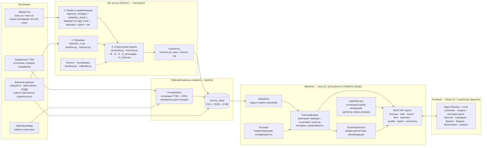
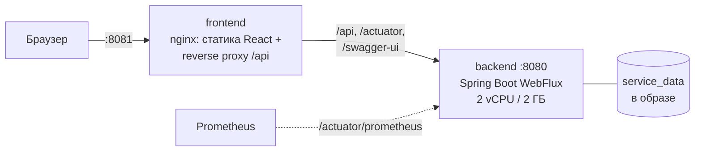

# Архитектура решения

## Модули и поток данных



Модули соответствуют цепочке критерия: **приём/нормализация → признаки/геопривязка → ML-прогноз/агрегация → API → frontend**.

| Слой | Где | Что делает |
|---|---|---|
| Приём и нормализация | `Tramvay/ml/ingest.py`; онлайн — `IngestService` | сырые валидации → посадки маршрут × дата × час; сверка с labels: 0 расхождений на 65 664 ячейках |
| Признаки | `Tramvay/ml/calendar_ru.py`, `weather.py`, `regimes.py` | производственный календарь, осадки, режимы маршрутов и события со ссылками |
| Геопривязка | `pipeline/build_service_data.py` | остановки и порядок следования (ГТФС для 1/5/7/11/12, OSM для 17/25/26/28/50), доли посадок по остановкам |
| Геопривязка посадок по расписанию | `pipeline/schedule_binding.py` (тесты `pipeline/tests/`) | посадка (маршрут, выход, время) → рейс графика → остановка; статусы и отчёт о покрытии; фактические доли остановок → `stop_weights.csv` при достаточном покрытии |
| ML-прогноз | `Tramvay/ml/structural.py`, `forecast.py`, `horizons.py` | почасовой прогноз на 61 день, месяц с интервалом, сценарий 2026 |
| Агрегация | `backend/.../forecast/ForecastEngine.java` | сумма по маршрутам, остановкам, участкам, интервалам дат и часов; гранулярность час / день / месяц / итог |
| Корректирующие коэффициенты | `backend/.../forecast/Scenario.java` (порт `ml/scenario.py`, сверено до единицы) | погода, сезон (месяц), маршрут, день недели, события |
| Выпуск: усиление и резерв | `Tramvay/ml/fleet.py` (`reinforcement`, `reserve`) → `/api/v1/fleet` | где добавить вагоны и где их снять без переполнения |
| Сводка диспетчера | `backend/.../summary/SummaryService.java` | пик, сопоставимый день, усиление и резерв выпуска, горячие остановки, события, рекомендации, XLSX |
| Детектор смены режима, живой факт | `backend/.../ingest/IngestService.java` (`detect`, `simulate`, `live`) | серии часов с отклонением факта от прогноза больше порога → алерт; симуляция потока для демо |
| API | `backend/.../api/*` | REST, problem+json, OpenAPI/Swagger, Prometheus-метрики |
| Frontend | `frontend/` | дашборд с картой, графиками, сценариями, выгрузкой |

## Почему так

- **Модель считается офлайн, сервис отдаёт готовые ряды.** Структурная модель пересчитывается за секунды
  (`py -m ml export`), а весь прогноз помещается в ~2 МБ CSV (~5 МБ в памяти). Поэтому backend держит ряды в памяти как массивы
  `double[]` и агрегирует их на лету: запрос — это проход по нужным ячейкам, без обращений к БД и без
  инференса. Отсюда p95 в единицы–десятки миллисекунд.
- **Корректирующие коэффициенты — множители поверх прогноза.** Модель не переобучается, поэтому ползунки
  в интерфейсе меняют прогноз мгновенно. Формулы перенесены из `ml/scenario.py` и сверены с Python
  (интеграционный тест `weatherFactorMatchesPythonFormula`).
- **Реактивный стек (WebFlux/Netty).** Неблокирующий сервер без пула потоков на запрос. Потоковый приём
  CSV декодирует тело построчно и не держит его в памяти. XLSX собирается на `boundedElastic`, чтобы не
  блокировать event loop.
- **Stateless → горизонтальное масштабирование.** Экземпляры backend независимы: данные неизменны и
  вшиты в образ. Балансировщик распределяет запросы без sticky-сессий. Принятые валидации (`/ingest`)
  хранятся в памяти экземпляра — это демонстрационный контур. В продуктиве они пишутся в общий поток:
  Kafka → ClickHouse (см. план развития).

## Развёртывание



Горизонтальное масштабирование — N реплик backend за nginx-балансировщиком (`docker-compose.scale.yml`,
`deploy/nginx-lb.conf`), замер 1/2/3 реплик и план дальнейшего масштабирования — в
[README](../README.md#горизонтальное-масштабирование).

Сборка образа backend — многоэтапная (`backend/Dockerfile`):
1. `python:3.13-slim` — пайплайн собирает `service_data/` из артефактов модели, справочников и внешних данных.
   Так приём данных воспроизводим при каждой сборке.
2. `maven:3.9-eclipse-temurin-21` — сборка jar.
3. `eclipse-temurin:21-jre-alpine` — runtime без root; healthcheck `/actuator/health/readiness`.

## Геопривязка остановок

В валидациях нет идентификатора остановки: `place_id` — площадка или депо. Поэтому прогноз маршрута
раскладывается по остановкам **априорными долями** (`pipeline/build_service_data.py → stop_weights`):
- направления делят посадки поровну;
- внутри направления вес остановки: начальная ×1.5, конечная прибытия ×0.05 (на ней не садятся);
- пересадочные узлы (метро, вокзалы, МЦК/МЦД, площади, рынки) ×2;
- к концу рейса вес убывает линейно, до ×0.5.

Сумма долей по маршруту равна 1, поэтому сумма по остановкам совпадает с прогнозом маршрута (тест
`allStopsOfRouteSumToRouteTotal`). Участок — это отрезок подряд идущих остановок одного направления.
Фактические доли кладутся в `data/reference/stop_weights.csv` (`route, stop_id, weight`), и пайплайн
подхватывает их без изменения кода: для перечисленных остановок вес из файла заменяет априорный.

### Привязка посадок по расписанию — `pipeline/schedule_binding.py`

```
валидации (;-CSV, потоково) ─► посадки: validation_result 1, маршрут из ngpt_route, время tran_date_time
расписание (лист «Расписание» или CSV той же структуры) ─► (маршрут, график) → рейсы: остановки + отправления
        │
        └─► посадка (маршрут, bus_exit_no = график, минута суток) ─► рейс ─► остановка ─► статус
              ─► отчёт JSON · привязанные посадки CSV · маршрут × направление × остановка × час
              ─► доли остановок → stop_weights.csv (только маршруты с достаточным покрытием, флаг --write-weights)
```

- **Рейс:** кандидаты — рейсы графика, у которых `[первое отправление − tolerance; последнее + tolerance]` содержит
  время посадки (`--tolerance`, 3 мин). Пересечение нескольких рейсов — берётся тот, внутри которого время.
  Рейсы через полночь продолжаются за 24:00: посадка в 00:05 ищется и как 24:05.
- **Остановка:** последняя остановка рейса, отправление с которой ≤ время + `--slack` (0,5 мин): вагон стоит у неё
  или только что отошёл.
- **Расписание — шаблон по времени суток.** Даты расписания и посадки не сопоставляются: в справочнике
  расписание и наряд на 2026 год, валидации — за 2025. Тип дня (`service_id`) не учитывается.
- **Сверка вагона:** если дата посадки есть в «Наряде», `garage_number` сверяется с бортовым номером вагона графика
  (`depot_number`): поле `vehicle_check` = `match` / `mismatch` / `no_naryad`.
- **Статусы:** `bound`; `no_schedule_for_route` — маршрута нет в расписании; `no_schedule_for_grafic` — нет графика;
  `outside_trips` — время вне рейсов графика; `bad_record` — не разбираются время, маршрут или выход.
- **Порог записи долей:** по умолчанию ≥ 1000 привязанных посадок маршрута и ≥ 80 % его остановок с посадками
  (`--min-bound`, `--min-stop-share`). Маршрут ниже порога в файл не пишется и сохраняет априорные веса. Доля
  остановки делится на число её строк (конечная бывает в обоих направлениях), поэтому сумма по маршруту = 1.
  Строки других маршрутов в существующем файле сохраняются. По умолчанию файл не пишется.
- **Результат на данных хакатона.** В справочнике расписание — образец: 15 строк, маршрут 1, график 206, рейс
  06:53–07:11. На выгрузке 30.10–1.11.2025 (400 000 строк, 371 920 посадок) привязано 0: 350 699 — маршруты без
  расписания, 21 221 — маршрут 1 без графика 206 (он в эти дни не выходил). Отчёт —
  [`data/samples/binding_report_demo.json`](../data/samples/binding_report_demo.json). Корректность алгоритма
  проверяют 20 тестов на синтетическом расписании и на образце из справочника.
  С полным расписанием ГТФС модуль даст фактические доли без изменения кода.
